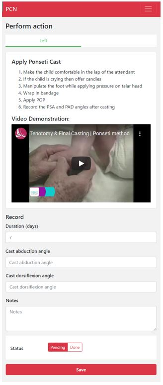

############
Action Screen
############

On the action screen you see information regarding the treatment. 

Below there is an example of what the action screen looks like:

--------
What do you do?
---------

1. On the screen there is a step-wise instruction what you have to do. 
  *Sometimes there is also an instructionvideo that you can watch*
  
  
2. After following the listed steps, you need to change the status from "pending" to "done". PCN wants confirmation that you have done the treatment, and therefore you need to change the status.

  .. image:: images/ActionScreen_1.JPG
   :scale: 80 %

3. In some action screens you need to fill in several fields
  - *For example during the casting phase you need to fill in the cast abduction and dorsiflexion angle*
  
  
  .. image:: images/ActionScreen_2.JPG
   :scale: 80 %
   
   
