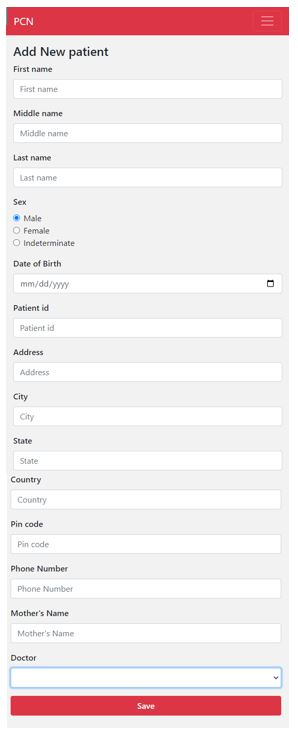

#######
Add a new patient
#######

In this screen, you need to fill in personal information about the patient. Below you can find an example of what the screen looks like:

   
----   
What do you do?
----

You need to fill in the the personal information. The most important fields are: 
   
   - **Date of birth:** 
   Make sure the date of birth is filled in. You can do this by either filling in the date manually (mm/dd/yy), or clicking on the little calendar on the right side and clicking on the date of birth. 
   
   - **Patient id:**   
   This is a code for the patient, used by PCN. The code should be unique (meaning that there is no other patient in PCN stored under the same code), otherwise PCN will not accept it.  
      - Best practice: use the alphabet and numbers for your code, and avoid special characters or white spaces. 
      - For example: Your initials and a number (AA001)
   
   - **Doctor:** 
   Make sure your own name is filled in. By default the name of the user who is logged in is shown. If you need to change this, click on the drop-down menu and select your own name. 

.. image:: images/AddNewPatient_1.JPG
   :scale: 80 %
   
When you finished and are satisfied with the answers, you can click on the “Save” button. 
