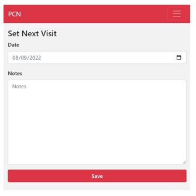
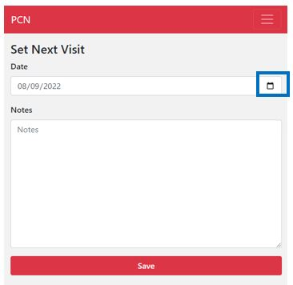

#######
Set Next Visit
#######

This is the last activity screen that is part of the current visit of the patient. In this screen, you can set the visit for the patient. Below you can find an example of what the screen looks like:

   
----   
What do you do?
----

Automatically, a new visit date is set by PCN. This is based on the duration of the previously decided treatment. If you want to change the date (because that works best with your clinic's logistics), you can change the data by clicking on the little calendar on the right side of the field and selecting the date that you want.  
   

   
   
When you are satisfied with the date, you can click on the “Save” button. 
