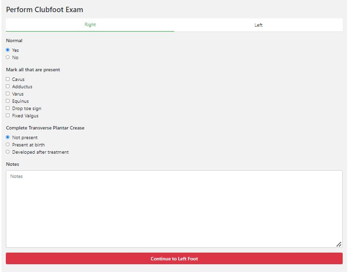

#######
Perform clubfoot exam
#######

In this screen, you need to perform the clubfoot exam. This is done for both the right and the left foot separately. Below you can find an example of what the screen looks like:

   
   *Sidenote: Dropped toe sign = resting posture of the toes in plantarflexion and absent active dorsiflexion movement after plantar stimulation of the foot*
   
----   
What do you do?
----

   - You need to fill in the the questions (including the key indicators of clubfoot) and click on “Continue to Left foot”.
   
   -	Now the screen for the left foot appears. Then perform the exam on the left foot and enter the data. When you finished and are satisfied with the answers, you can click on the “Save” button. 

