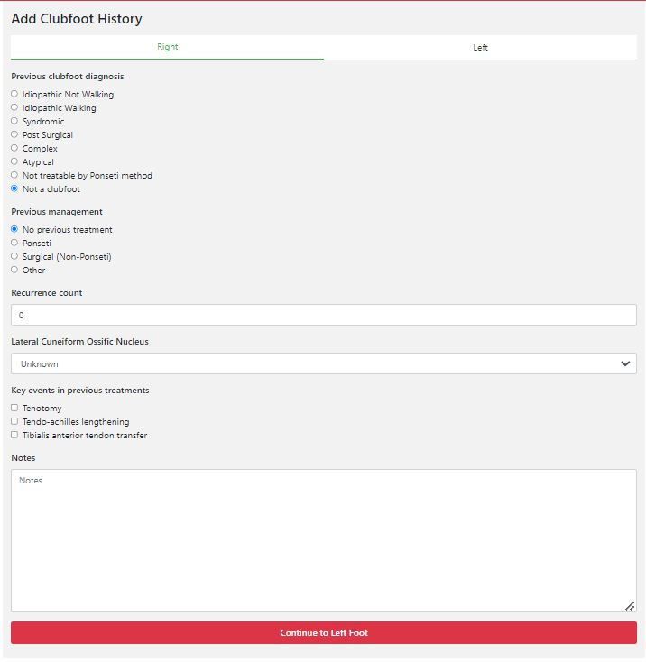
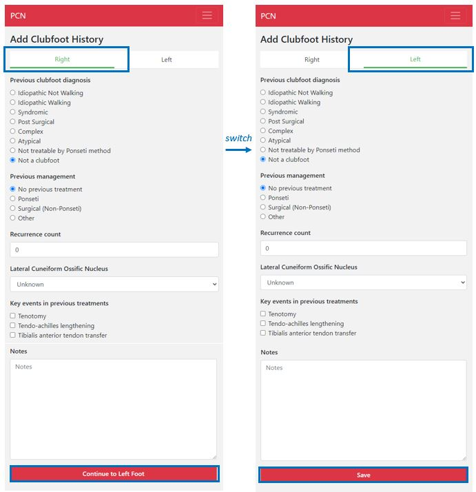

#######
Clubfoot history
#######

In this screen you will need to add the clubfoot history of the patient, for both feet. By default, the feet are scored as “not a clubfoot” and “no previous treatment”. 

   
----   
What do you do?
----

   - You need to fill in the clubfoot history for both feet. The first screen that appears is the screen for the right foot. After filling in everything you need to click on “Continue to Left Foot”.
   
   -	Now the screen for the left foot appears. Again, you need to fill in everything, and once you are satisfied with the answers, you can click on “Save”.

----

*Sidenotes:*
   - *The screens shows if you are filling in information for the right or the left foot, by underlining and coloring the right or left in green. If you want to switch back to the other foot, you can manually click on the “right” or “left” button.*
   - *You  must fill in the **original diagnosis** *, even if this is not the same as the status right now (this is especially important when filling in data retrospectively). This also holds true for the recurrent count (you need to fill in the recurrence count at the time of the patients first visit). It is important for the algorithm and future decisions for treatment that the right information is filled in*

