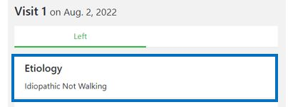

#######
End of Visit
#######

This is the last screen that is shown before ending the visit of the patient. In this screen, you see an overview of the visit. Below you can find an example of what the screen looks like:

   
----   
What do you see?
----

In this screen a short summary of all the information of the current visit is shown.

  - On top, there is information about the etiology.
      *Note: This is based on the information from the clubfoot history screen.*

   
   
    - Below, there is information about the phase of treatment.
      *Note: This is based on the information from the treatment screen.*

   
   
  - Below, there is information about the treatment 
      *Note: This is based on the information from the treatment screen.*

   
   
 - Below, there is information about the scoring 
      *Note: This is based on the information from the scoring screen.*

   
      - If you want to change the scores, you can click on the blue "edit" button on the right side. You are then directly linked to the Scoring screen, where you can alter the scores that you filled in. 
      

   
    - Below, there is information about the observations during the visit.
      *Note: This is based on the information from the observations screen.*

   
   
      - If you want to change the observations, you can click on the blue "edit" button on the right side. You are then directly linked to the Observations screen, where you can alter the observations that you filled in, or add new observations. 
      

   
   
When you are satisfied with everything, you can click on the “End Visit” button. 

.. image:: images/EndOfVisit_9.JPG
   :scale: 80 % 
