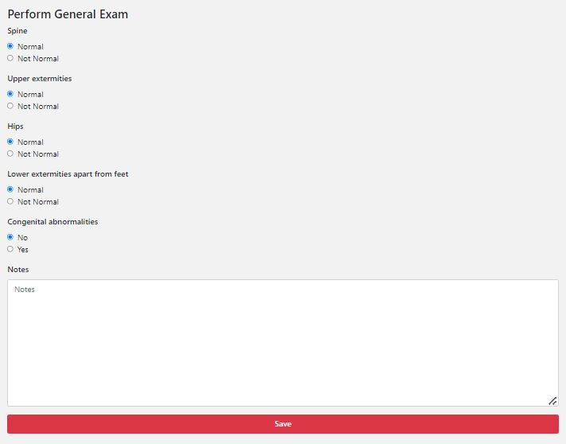

############
General Exam
############

In this screen, you need to fill in the information about the general exam you performed. 

Below there is an example of what the screen looks like:

--------
What do you do?
---------

Check the answers, and change them accordingly. If you are satisfied with your answers, you can click on “Save”.

 
