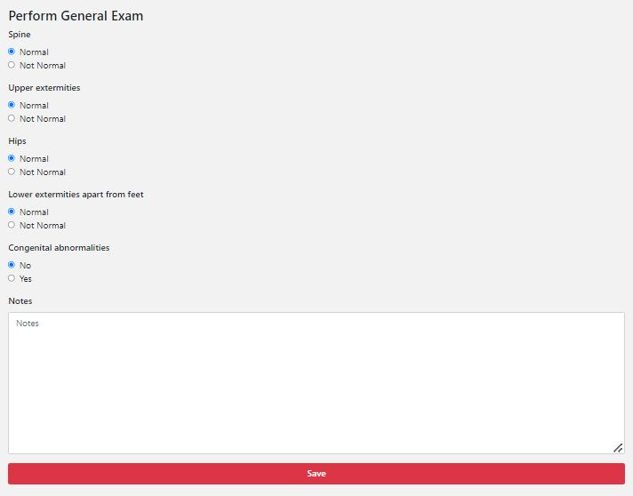

############
General Exam
############

In this screen, you need to fill in the information about the general exam you performed. The data entered in this screen will help PCN in getting the right diagnosis and therefore selecting the correct algorithms. 
   
   For example: When the "Congenital Abnormalities" button is set on "yes", PCN will continue with algorithms for syndromic clubfoot. 

Below there is an example of what the screen looks like:

--------
What do you do?
---------

Check the answers, and change them accordingly. If you are satisfied with your answers, you can click on “Save”.

 
