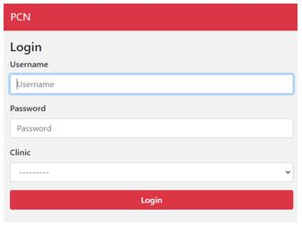
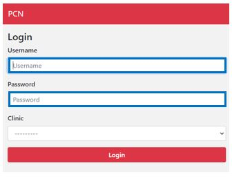
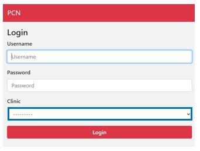

#######
Login
#######

This is the first screen that you see when you login in PCN. Below you can find an example of what the screen looks like:

   
----   
What do you do?
----

1. You need to fill in your username and password to login. 
   
 

   
2. You need to select you clinic. 

3. Now you can click on the “Save” button. You are redirected to the homepage of PCN.
