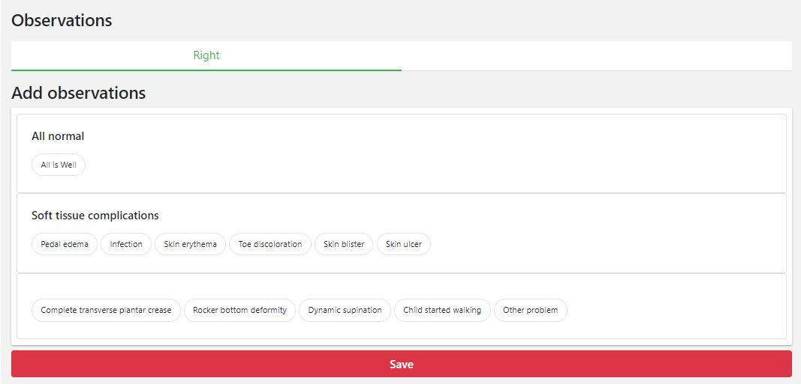
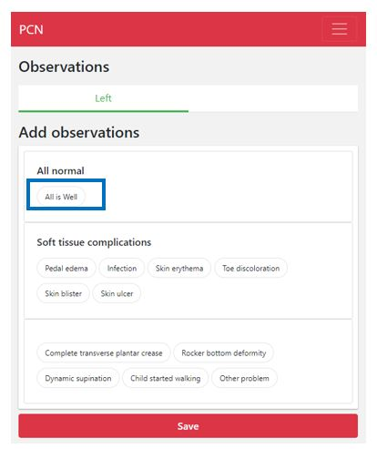

############
Observations
############

On the observation screen you can add your observations (for both feet). The observations that appear on the screen are dependent on the diagnosis/previous observations, but you can always manually add more observations (as explained below). 

Below there is an example of what the observations screen looks like:

What are the options?
---------

If everything is ok, you can click on “All is well”. 

Otherwise, you have two options:
   1. If you had an observation that is already listed on the screen: click the observation on the screen. A new field will appear with the name of the observation that you clicked. You can also add some notes if you like. If you want to remove the observation, you can click on the black cross on the upper right side of the field.
   
   .. image:: images/Observations_2.JPG
      :scale: 50 %
   
   
   .. image:: images/Observations_3.JPG
      :scale: 50 %
   
   
   2. If the observation you want to add is not listed on the screen, you can click on “other problem” on the bottom right side of the screen. You can add notes in the screen that appears.
   
    .. image:: images/Observations_4.JPG
      :scale: 50 %

   
 
