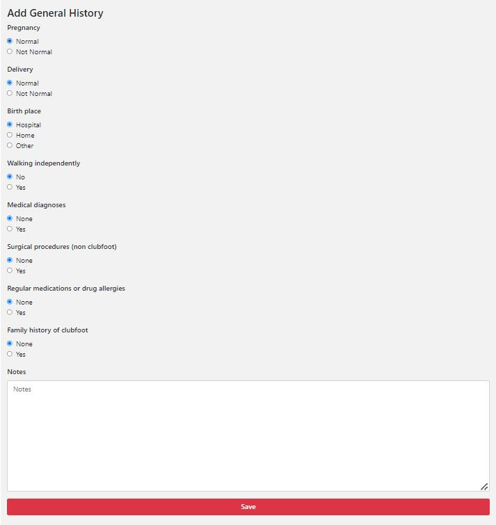
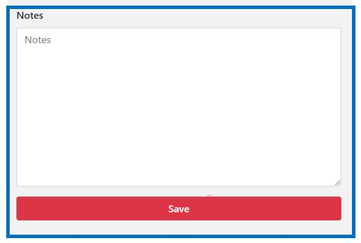

#######
Patient history
#######

In this screen you need to fill in the general history of the patient. By default, “none” is filled in for all questions. Check all the items on the screen, and if you are satisfied with the answers, click on “Save” to continue.

.. tip:: There is a textbox at the bottom of the screen in which you can type additional notes. These are there for your documentation only, PCN cannot process the text in this field. 

