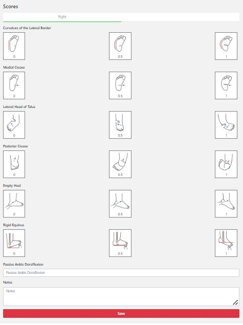

#######
Scores
#######

In this screen you will need to score both feet according to the Pirani score. You need to do this for both feet (in a bilateral case). 

   
----   
What do you do?
----

  - Fill in the scoring by clicking on the right value/picture for each item. 
  
  - In addition, you need to fill in the passive ankle dorsiflexion at the bottom of the screen. 
  
  - Click on “Save” when you are done.
  
  
  
----   
Notes
----

This screen will only show up if this patient has an idiopathic clubfoot. This screen will not show up if the diagnosis is syndromic, complex or postsurgical.

  
