#######
Patient Record
#######

This is the patient record. This screen shows up when you click on a patient. The screen contains information regarding previous visits. You can use this screen to confirm the previous details that were entered, and to start a new visit. 

.. image:: images/ReportScreen_home.JPG
   :scale: 80 %
   
----   
What do you see?
----

In this screen a short summary of all the information of the current visit is shown.

On top, there is some general information about the patient. On top the name and patient ID are shown, and then some information regarding the age, sex, amount of visits and the date of last visit. 

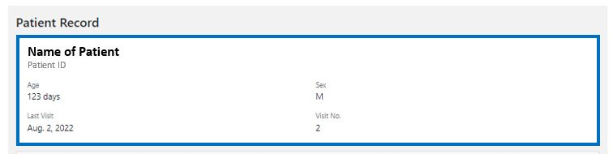
   
   
   
Below that, there is information about the general history. 

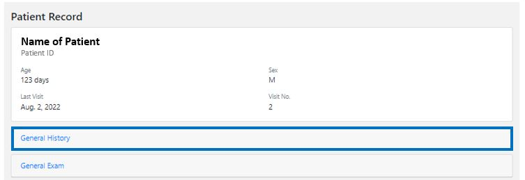

*  *Note: This is stored in a drop down menu, so if you click on "General History", the information becomes visible.*
    
    
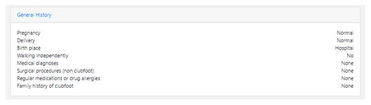
   
   
Below, there is information about the examination of the clubfoot. 

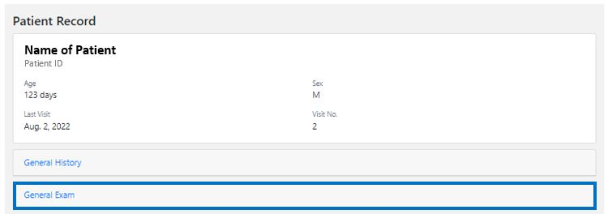

*  *Note: This is also stored in a drop down menu, so if you click on "Clubfoot Examination", the information becomes visible.* 
    
    
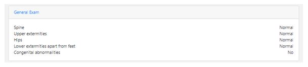
   
   
Below, there is some information about the etiology and general history of the patient. 
   
   
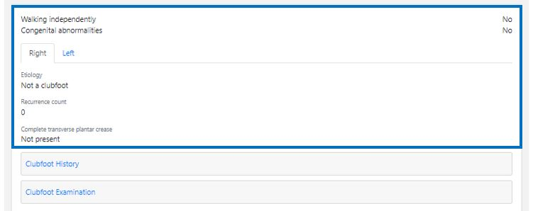

Below, there is information about the clubfoot history. 

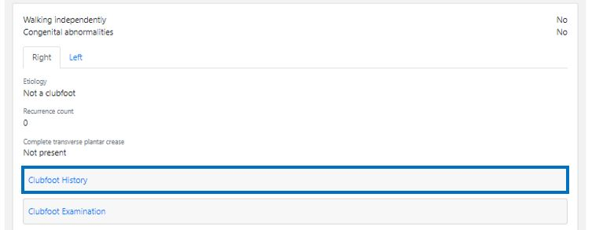

*  *Note: This is stored in a drop down menu, so if you click on "Clubfoot History", the information becomes visible.* 
    
    
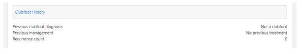
   
   
Below, there is some more information about the clubfoot examination. 

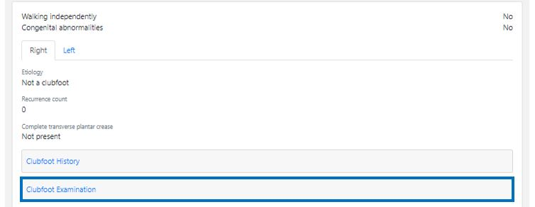

*  *Note: This is stored in a drop down menu, so if you click on "Clubfoot Examination", the information becomes visible.* 
    
    
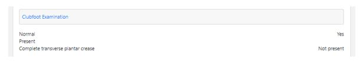
   
   
Below, there is some specific information about the previous visits. 

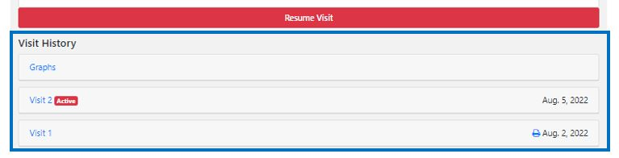
   
   
All the different visits are included. If you want to see specific information for a visit, you can click on the visit, and the information of this specific visit will become visible. 

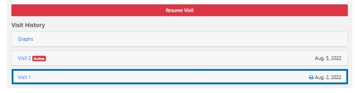

*  If there is still an active visit, you can see this because there is an red box with "Active" next to the visit. 
  
  
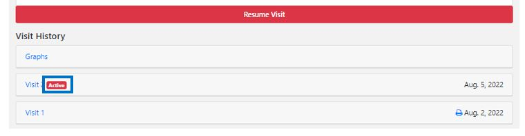
  
  
*   If you want to resume this visit. You can click on "Resume Visit" button, which is above the Visit history overview. 
  
  
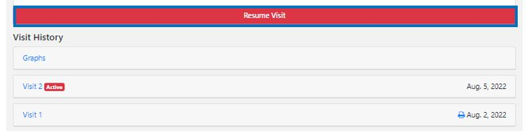

   
Furthermore, the visit overview includes some graphs. These graphs show different scores over time. If you click on the "Graphs" title, the different graphs unfold. 

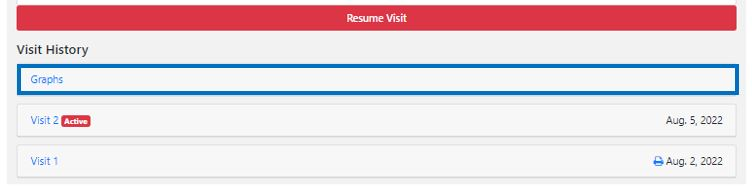

There are graphs for both feet, so if you want to see the graph of the other side, just switch to the other side in the "Left" or "Right" tab just above the graphs.

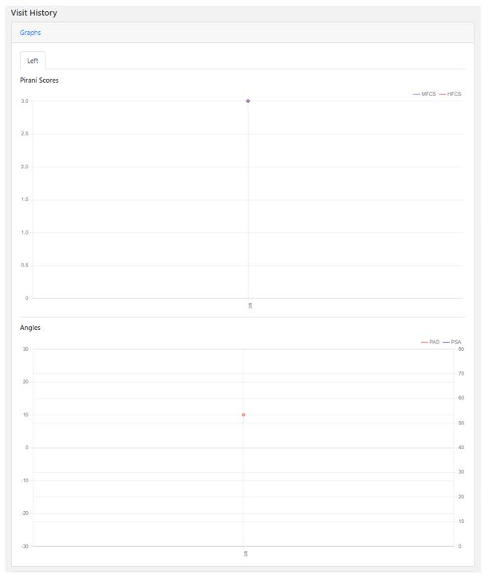

*  There are two different graphs that are shown. The top graphs shows the Pirani scores. The red line depicts the hindfoot scores, and the blue line depicts the midfoot scores. 

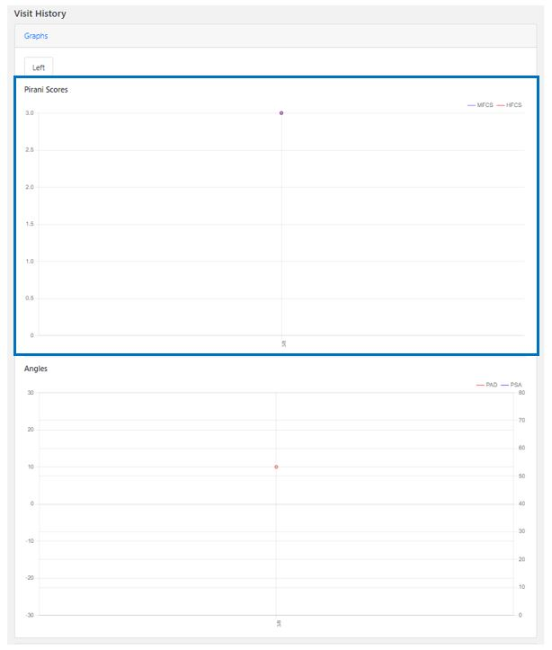

*  The bottom graph shows the angles. In red, the passive ankle dorsiflexion is shown, and in blue the passive subtalar abduction is shown. 

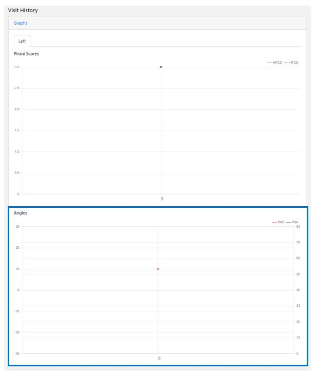

