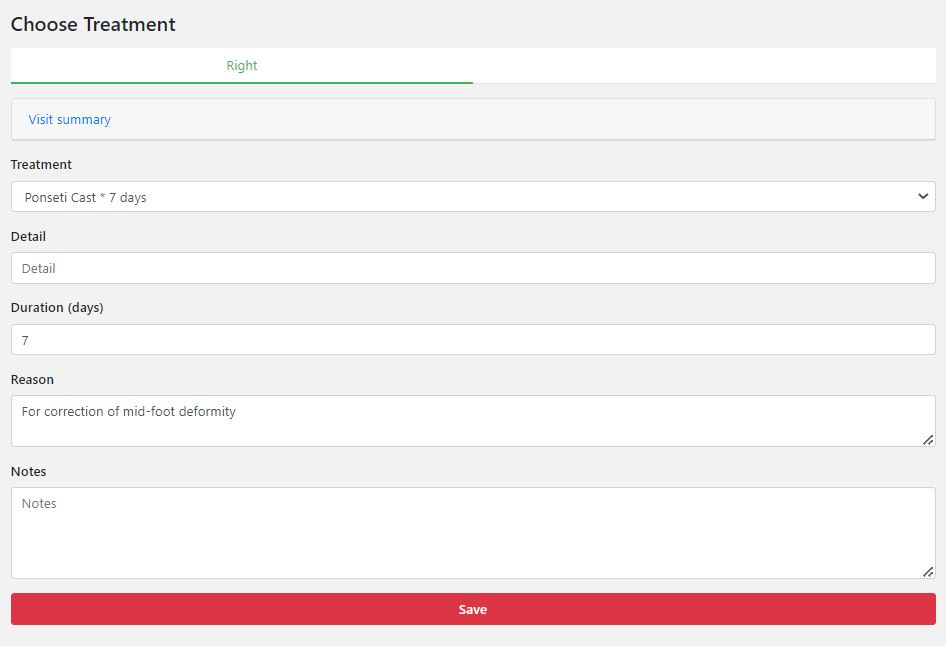
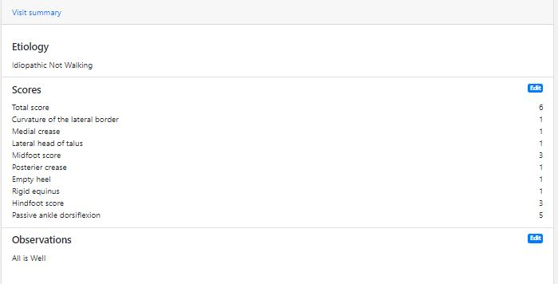
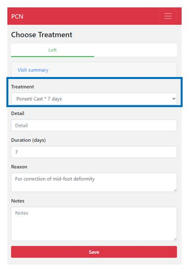
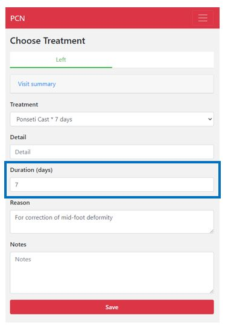

#######
Treatment
#######

In this screen you will see the recommended treatment for the patient. Furthermore, there is a visit summary with the information you entered of the visit. 

   
   
----   
What do you do?
----

If you want to see the summary of the visit. Click on "Visit summary", and the summary will expand.
  

*Sidenote: You can manually adapt these scores (if you think you entered the wrong data) by clicking on the “Edit” button. You will be taken back to the scoring screen where you can edit the scores.*

:doc:`ScoringScreen`  
   
   
Beneath the visit summary, you can see the recommended treatment. If you want to change the treatment, you can manually do so by clicking the arrow on the right. A drop-down menu opens with all the possible treatments listed. The recommended treatment by PCN has an asterisk next to it (sometimes there are more treatments that are recommended, but by default PCN shows the most recommended treatment). If you change the treatment manually, you will **always** have to give a reason (this field will pop-up).    

  

Below the recommended treatment, you can see the duration of the treatment. You can manually adapt the duration (if the logistics work better in your hospital for example) by clicking on the arrows on the right side of the field or to remove the number and enter it manually.  
  

  

Click on “Save” when you are done.
  
  
